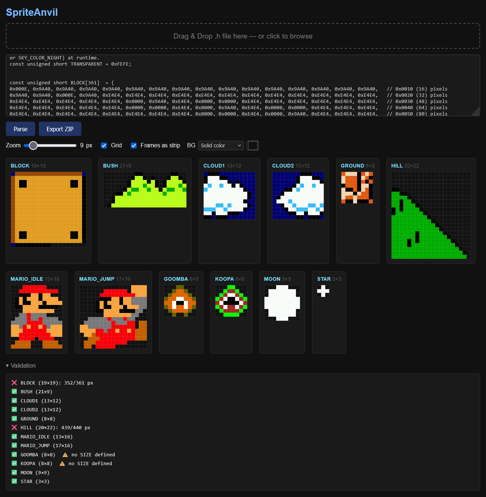
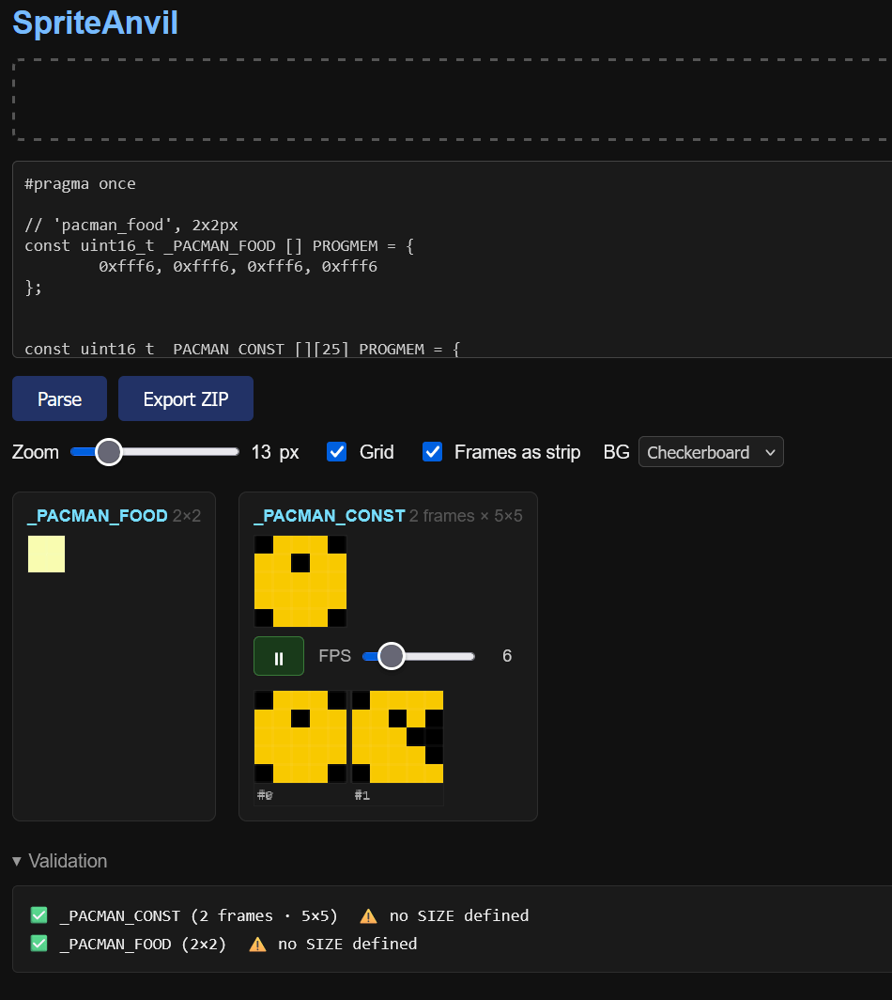
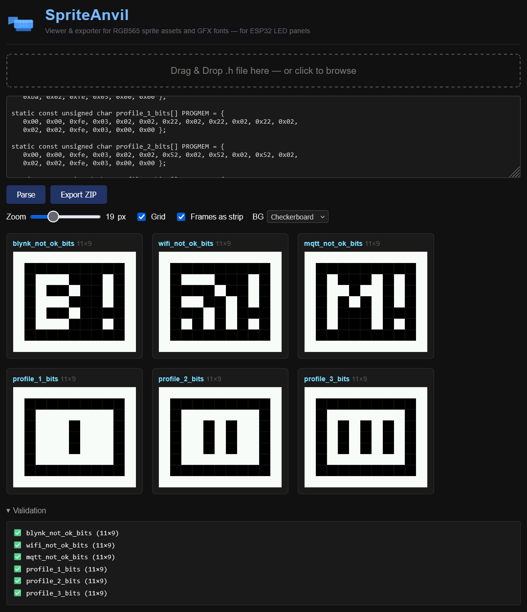
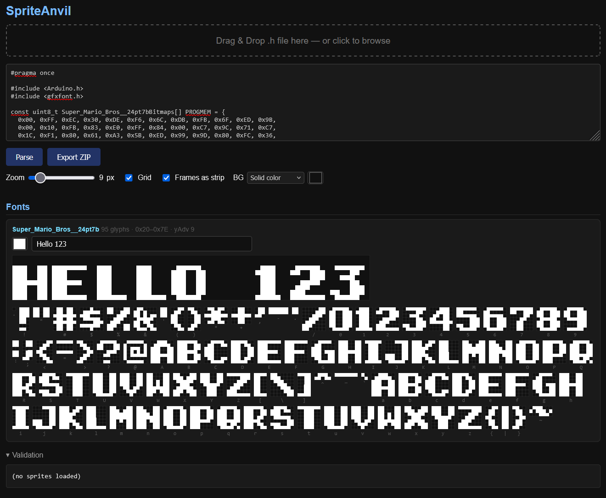

<h1>
  
  SpriteAnvil
</h1>

[](https://github.com/aschoelzhorn/spriteanvil/actions/workflows/deploy-pages.yml)
[](LICENSE)

**[Live demo → https://aschoelzhorn.github.io/spriteanvil](https://aschoelzhorn.github.io/spriteanvil)**

A browser-based tool for viewing, editing, and exporting pixel-art sprite assets for ESP32/Arduino display projects (LED panels, TFT, OLED).  
No install required — use it instantly in the browser via GitHub Pages, or run it locally in Docker.

---

## Screenshots

|                Sprites & Zoom                |                  Animation Strip                  |
|:--------------------------------------------:|:-------------------------------------------------:|
|  |  |

|                BW Icons (1-bit)                |          Font Charmap & Preview          |
|:----------------------------------------------:|:----------------------------------------:|
|  |  |

---

## Features

|                   |                                                                                                     |
|-------------------|-----------------------------------------------------------------------------------------------------|
| **Parse**         | Drag & drop or paste `.h` files containing `uint16_t` / `unsigned short` / `unsigned char` C arrays |
| **Render**        | RGB565 → RGB888 canvas preview with zoom (1–64 px) and optional pixel grid                          |
| **1-bit bitmaps** | Monochrome `unsigned char` XBM/PROGMEM bitmaps rendered as black & white (LSB-first, byte-padded)   |
| **Transparency**  | Checkerboard pattern *or* a custom solid colour for transparent pixels (`0xFEFE`)                   |
| **Animation**     | Multi-frame arrays play as live animation — ▶/⏸ toggle + per-animation FPS slider                   |
| **Strip view**    | Animation frames shown as a single side-by-side canvas or as individual canvases                    |
| **Validation**    | Per-sprite ✅/❌ pixel-count check; ⚠️ warning when no SIZE array is found                          |
| **Multi-file**    | Load multiple `.h` files — prompted to **Add** or **Replace** existing sprites                      |
| **Export ZIP**    | Original source files + per-sprite split `.h` + `.png` preview + root `assets.h`                    |
| **Fonts**         | Parse and preview Adafruit GFX font files — glyph charmap + live text preview with colour picker    |

---

## Quick Start

### Browser (GitHub Pages)

No setup needed — just open the live demo:  
**[https://aschoelzhorn.github.io/spriteanvil](https://aschoelzhorn.github.io/spriteanvil)**

### Local (Docker)

```bash
docker compose up
```

Then open **http://localhost:8080** in your browser.

---

## Supported `.h` File Formats

The parser handles all common Arduino/ESP32 asset patterns without modification:

```cpp
// 1. RGB565 colour array — named size companion (case-insensitive)
const unsigned short BLOCK[361] = { … };
const byte BLOCK_SIZE[2] = {19, 19};

// 2. PROGMEM + empty brackets
const uint16_t MARIO_IDLE [] PROGMEM = { … };
const byte MARIO_IDLE_SIZE[2] = {13, 16};

// 3. #define width/height macros (used by TFT_eSPI, OLED libraries)
#define logo_width  240
#define logo_height 240
static const uint16_t logo_bits [] PROGMEM = { … };

// 4. Monochrome 1-bit bitmaps (XBM / u8g2 / Adafruit OLED style)
//    Bits are LSB-first, rows padded to byte boundary
#define icon_width  45
#define icon_height 45
static const unsigned char steam_bits [] PROGMEM = { 0x00, 0xf8, … };

// 5. Named colour constants resolved automatically
const unsigned short M_RED = 0xF801;
const unsigned short TRANSPARENT = 0xFEFE;

// 6. 2-D frame animation array
const uint16_t _PACMAN_CONST [][25] PROGMEM = {
    { /* frame 0 */ … },
    { /* frame 1 */ … }
};
```

### Size resolution

The parser determines width × height using the first matching strategy:

1. **`_SIZE` byte array** — `const byte MY_SPRITE_SIZE[2] = {w, h};`
2. **`#define` macros** — `#define NAME_width W` / `#define NAME_height H`, matched by prefix (longest first)
3. **Square fallback** — `sqrt(pixel_count)` (a ⚠️ warning is shown in the validation panel)

### Transparent pixels

`0xFEFE` (or the symbol `TRANSPARENT`) is treated as transparent.  
Use the **BG** selector to choose how transparent pixels are displayed:

- **Checkerboard** — grey checker pattern (Photoshop-style)
- **Solid color** — fill with any colour (useful for sprites that are hard to see on a checker)

---

## Project Structure

```
spriteanvil/
├── web/
│   ├── index.html       # UI
│   ├── app.js           # Parser, renderer, animation, export
│   └── styles.css       # Dark-theme styles
├── Dockerfile           # nginx:alpine serving web/
├── docker-compose.yml   # Port 8080
└── examples/
    ├── mario_assets.h              # LED panel: Mario sprites (named constants, PROGMEM)
    ├── pacman_assets.h             # LED panel: Pacman animation (2-D frame array)
    ├── story_dune_assets.h         # LED panel: Dune backgrounds (64×64, lowercase _size)
    ├── fonts/
    │   ├── mario_Super_Mario_Bros__24pt7b.h   # GFX font (Super Mario Bros)
    │   └── pacman_hour_font.h                 # GFX font (Pacman hour digits)
    ├── icons/                      # OLED 1-bit monochrome icon sets
    │   ├── icon.h                  # Status bar icons (11×9, shared #define)
    │   ├── icon_big.h
    │   ├── icon_shared.h           # Multi-define: rancilio/gaggia/ecm logos
    │   ├── icon_simple.h
    │   ├── icon_smiley.h
    │   └── icon_winter.h
    └── oled/                       # Color OLED/TFT RGB565 images (TFT_eSPI style)
        ├── icon_ecm_color.h        # 240×240 RGB565, #define macros
        ├── icon_gaggia_color.h     # 216×131 RGB565
        ├── icon_generic_color.h    # 240×240 RGB565
        ├── icon_rancilio_color.h
        ├── icon_shared_color.h     # Mixed: 1-bit update icon + 240×240 color logo
        └── icon_simple_color.h     # 1-bit icons + color images in one file
```

---

## GFX Font Files

The tool also parses Adafruit GFX-compatible font headers. These are the `GFXfont` structs used by the Arduino GFX / Adafruit GFX library:

```cpp
const uint8_t MyFontBitmaps[] PROGMEM = { … };      // packed 1-bit glyph bitmaps

const GFXglyph MyFontGlyphs[] PROGMEM = {
    { bitmapOffset, width, height, xAdvance, xOffset, yOffset },
    …
};

const GFXfont MyFont PROGMEM = {
    (uint8_t *)MyFontBitmaps,
    (GFXglyph *)MyFontGlyphs,
    0x20, 0x7E,   // first, last codepoint
    13            // yAdvance
};
```

Once loaded, each font is shown in a **Fonts** section below the sprites with:

- A **glyph charmap** — every character in the font rendered at the current zoom
- A **live text preview** — type any string to see it rendered pixel-accurately
- A **colour picker** to change the glyph foreground colour

---

## Export ZIP Layout

```
assets.zip
├── assets.h                    # Root include (original source files)
├── <original_filename>.h       # Original source file(s), unchanged
└── sprites/
    ├── block.h                 # Per-sprite header (preserves PROGMEM, type, SIZE)
    ├── block.png               # PNG preview at current zoom
    ├── mario_idle.h
    ├── mario_idle.png
    └── …
```

Split `.h` files preserve the original declaration style — `uint16_t` vs `unsigned short`, `PROGMEM` attribute, and the `_SIZE` companion array.

---

## Controls Reference

| Control                      | Description                                                 |
|------------------------------|-------------------------------------------------------------|
| Drag & drop / click dropzone | Load a `.h` file                                            |
| Paste + **Parse** button     | Parse code pasted into the text area                        |
| **Zoom** slider              | 1–64 px per pixel                                           |
| **Grid** checkbox            | Pixel grid overlay (auto-hidden below 4 px zoom)            |
| **Frames as strip** checkbox | Show animation frames in one canvas or individually         |
| **BG** selector              | Checkerboard or solid colour for transparent pixels         |
| Colour picker                | Transparent pixel fill colour (visible in Solid color mode) |
| ▶ / **⏸** button             | Play / pause animation per sprite group                     |
| **FPS** slider               | Animation speed 1–30 fps per sprite group                   |
| **Export ZIP**               | Download everything as a ZIP archive                        |
| Font colour picker           | Change the glyph foreground colour for a loaded font        |
| Font text input              | Type preview text to render the font at current zoom        |

---

## 📄 License

This project is licensed under the MIT License - see the [LICENSE](LICENSE) file for details.

---

## 🤝 Contributing

Contributions are welcome! Please feel free to submit a Pull Request.

1. Fork the repository
2. Create a feature branch (`git checkout -b feature/AmazingFeature`)
3. Commit your changes (`git commit -m 'Add some AmazingFeature'`)
4. Push to the branch (`git push origin feature/AmazingFeature`)
5. Open a Pull Request
